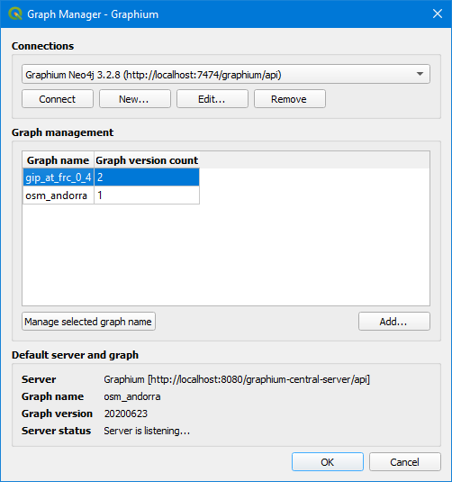

# QGIS plugin Graphium 

This is a QGIS extension for the road network management tool Graphium.

# Features

- Manage connections to Graphium servers
- Graph management, e.g add, activate, download or remove graph versions
- Create graphs from OpenStreetMap or GIP.at datasets
- Utilities like map-matching or routing
- Use of the QGIS processing framework for all Graphium tasks

Detailed installation instructions and descriptions of all features and algorithms are available in the project wiki.

# Installation

The latest release of the plugin (ZIP file) is available on the
[releases](https://github.com/graphium-project/graphium-qgis-plugin/releases) page
of this repository. Use the QGIS Plugins dialog to install the plugin ("Install from ZIP").

# QGIS style for HD segments

The QML-file 'qgis/qgis_hd_segment_style.qml' can be loaded via the layer's property. Use "Style" > "Load style" at the bottom of the dialog.

Road type specific colors ('qgis/qgis_hd_segment_colors.gpl') can be set in the project properties. Navigate to the menu 'Project' > 'Properties...' > category 'Default styles' > 'Project colors' > 'Import colors' button.

